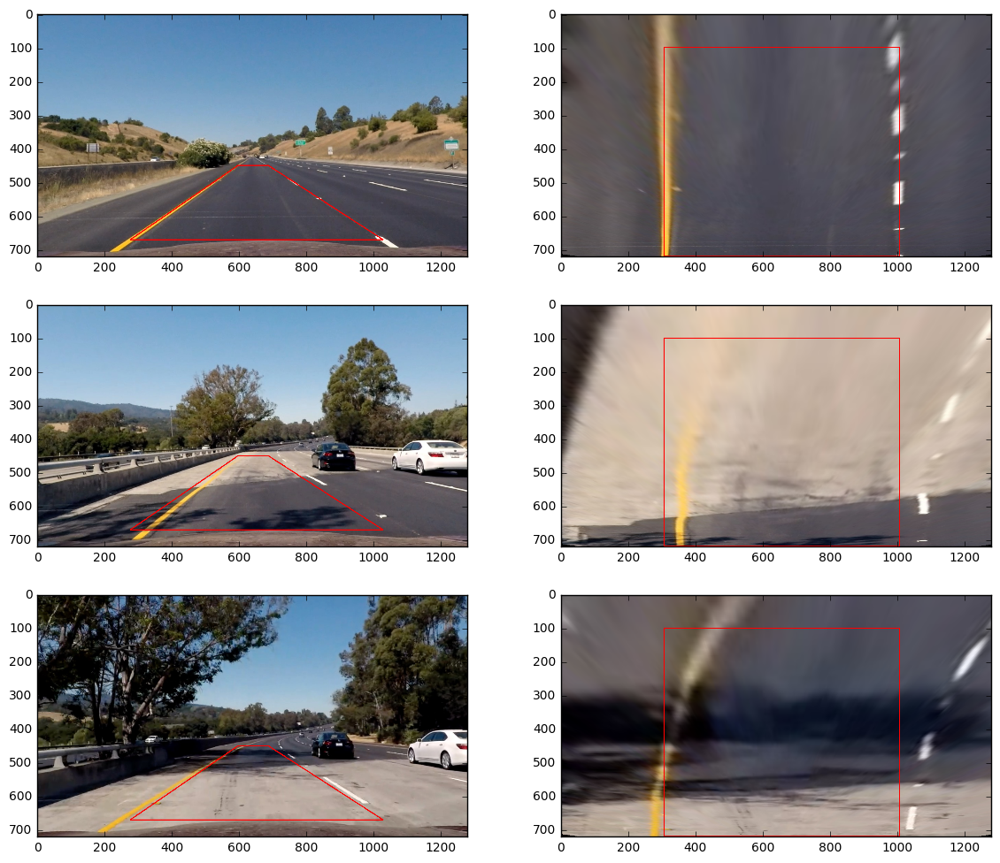

# Advanced Lane Line Finding
---

The goals / steps of this project are the following:

* Compute the camera calibration matrix and distortion coefficients given a set of chessboard images.
* Apply a distortion correction to raw images.
* Use color transforms, gradients, etc., to create a thresholded binary image.
* Apply a perspective transform to rectify binary image ("birds-eye view").
* Detect lane pixels and fit to find the lane boundary.
* Determine the curvature of the lane and vehicle position with respect to center.
* Warp the detected lane boundaries back onto the original image.
* Output visual display of the lane boundaries and numerical estimation of lane curvature and vehicle position.


## Contents of the Submission
---
The submission containes the following files and folders.
1. `README.md`, along with several `output*.png` files containing the graphics. Created from:
2. `main.ipynb`, the notebook containing the documentation and sources. 
3. `helpers.py`, several shortcuts for color space transforms
4. `binaryTransform.py`, several functions for converting an image to black an white.
5. `pipeline.py`, the final pipeline for processing an image sequence.

## [Rubric](https://review.udacity.com/#!/rubrics/571/view) Points
---
Here I will consider the rubric points individually and describe how I addressed each point in my implementation.  


## Writeup / README
---

* Provide a Writeup / README that includes all the rubric points and how you addressed each one.  You can submit your writeup as markdown or pdf.  [Here](https://github.com/udacity/CarND-Advanced-Lane-Lines/blob/master/writeup_template.md) is a template writeup for this project you can use as a guide and a starting point.  

You're reading it! Instead of writing a separate readme, I include everything relevant into this jupyter notebook. This reduces effort & redundancy.


## Camera Calibration
---

### Find Chessboard Corners

* Briefly state how you computed the camera matrix and distortion coefficients. Provide an example of a distortion corrected calibration image.

The code for this step is contained in `./camCal.py`, function `findCorners()`, and was derived from `./examples/example.ipynb`.

I start by preparing "object points", which will be the (x, y, z) coordinates of the chessboard corners in the world. Here I am assuming the chessboard is fixed on the (x, y) plane at z=0, such that the object points are the same for each calibration image.  Thus, `objp` is just a replicated array of coordinates, and `objpoints` will be appended with a copy of it every time I successfully detect all chessboard corners in a test image.  `imgpoints` will be appended with the (x, y) pixel position of each of the corners in the image plane with each successful chessboard detection.  


```python
import numpy as np
import glob
import cv2
from camCal import findCorners

# Make a list of calibration images
imageFiles = sorted(glob.glob('./camera_cal/calibration*.jpg'))

imggen = (cv2.imread(fn) for fn in imageFiles)

objpoints, imgpoints, images = findCorners(imggen)

```


```python
import matplotlib.pyplot as plt
%matplotlib inline

# show samples
I=(1, 2, 4, 10, 15, 16)
plt.figure(figsize=(14,6))
for i in range(6):
    plt.subplot(2, 3, 1+i)
    plt.imshow(images[I[i]])
#plt.subplot(2, 3, 2)
#plt.imshow(images[4])
#plt.subplot(2, 3, 3)
#plt.imshow(images[10])
#plt.subplot(2, 3, 4)
#plt.imshow(images[15])
#plt.subplot(2, 3, 5)
#plt.imshow(images[1])
#plt.subplot(2, 3, 6)
#plt.imshow(images[16])

```


### Camera Calibration and Distortion Coefficients
I then used the output `objpoints` and `imgpoints` to compute the camera calibration and distortion coefficients using the `cv2.calibrateCamera()` function.  I applied this distortion correction to the test image using the `cv2.undistort()` function and obtained the following result.

The code for this step is contained in ./camCal.py, functions camCal() and undistortImg().


```python
from camCal import camCal, undistortImg
%matplotlib inline

img=images[0]
shape=img.shape[::-1][1:]
mtx, dist, rvecs, tvecs=camCal(objpoints, imgpoints, shape)

image=cv2.imread('./camera_cal/calibration1.jpg')

# show samples
plt.figure(figsize=(14,6))
plt.subplot(1, 2, 1)
plt.text(100, -50, 'Original')
plt.imshow(image)
plt.subplot(1, 2, 2)
plt.text(100, -50, 'Undistorted')
plt.imshow(undistortImg(image, mtx, dist))


```


    <matplotlib.image.AxesImage at 0x7f5a1bf17da0>


## Pipeline (test-images)
---
Read in all files from test_images folder


```python
import numpy as np
import glob
import cv2
from camCal import findCorners

# Make a list of calibration images
testImageFiles = sorted(glob.glob('./test_images/*.jpg'))

testImages = [cv2.imread(fn) for fn in testImageFiles]

```

### Distortion Correction
- Provide an example of a distortion-corrected image.

In the following, I apply distortion correction to all sample images provided in the test_images folder. Finally I show three samples.


```python
from helpers import bgr_rgb

undistTestImages=[undistortImg(img, mtx, dist) for img in testImages];

# show samples
plt.figure(figsize=(14,5.5))
I=(0, 3, 6)
plt.subplot(2, 3, 1)
plt.text(-200, 250, 'Original', rotation=90)
plt.subplot(2, 3, 4)
plt.text(-200, 250, 'Undistorted', rotation=90)
for i in range(0,3):
    plt.subplot(2, 3, i+1)
    
    plt.imshow(bgr_rgb(testImages[I[i]]))
    plt.text(100, -50, testImageFiles[I[i]])

    plt.subplot(2, 3, i+4)
    plt.imshow(bgr_rgb(undistTestImages[I[i]]))

```


### Creating a Thresholded Binary Image
- Describe how (and identify where in your code) you used color transforms, gradients or other methods to create a thresholded binary image. Provide an example of a binary image result.

#### Gradients
Computing the gradient in x or y direction does not account for the diagonal directions of the left/right lanes. Therefore I define the directed gradient, which computes the gradient in direction of the angle alpha.


```python
from helpers import bgr_gray
from binaryTransform import dir_sobel_thresh

# show samples
I=(0, 6)
plt.figure(figsize=(14,5.5))
for i in (0,1):
    plt.subplot(2, 3, 1+i*3)
    plt.imshow(bgr_rgb(undistTestImages[I[i]]))
    b, s=dir_sobel_thresh(bgr_gray(undistTestImages[I[i]]), sobel_kernel=7, alpha=np.arctan(400/300), thresh=(125, 255))
    plt.subplot(2, 3, 2+i*3)
    plt.imshow(s, cmap='gray')
    plt.subplot(2, 3, 3+i*3)
    plt.imshow(b, cmap='gray')
```


In the first row we can clearly see that the left lane is nicely identified. The gradient is computed in the direction $\alpha=\arctan(400/300)$, where $400/300$ is the approximate slope of the left lane. The right lane can be identified by applying the angle $\alpha=\arctan(-400/300)$. However, we see poor performance in the second row due to poor contrast. Therefore I want to try color space transforms. But first, some more examples applying 'magnitude of the gradient' and 'direction of the gradient'.


```python
from helpers import bgr_gray
from binaryTransform import mag_thresh

# show samples
I=(0, 6)
plt.figure(figsize=(14,5.5))
for i in (0,1):
    plt.subplot(2, 3, 1+i*3)
    plt.imshow(bgr_rgb(undistTestImages[I[i]]))
    b, s=mag_thresh(bgr_gray(undistTestImages[I[i]]), sobel_kernel=7, thresh=(100, 255))
    plt.subplot(2, 3, 2+i*3)
    plt.imshow(s, cmap='gray')
    plt.subplot(2, 3, 3+i*3)
    plt.imshow(b, cmap='gray')
```


```python
from helpers import bgr_gray
from binaryTransform import dir_threshold

# show samples
I=(0, 6)
plt.figure(figsize=(14,5.5))
for i in (0,1):
    plt.subplot(2, 3, 1+i*3)
    plt.imshow(bgr_rgb(undistTestImages[I[i]]))
    b, s=dir_threshold(bgr_gray(undistTestImages[I[i]]), sobel_kernel=15, thresh=(0.9*np.arctan(420/300), 1.1*np.arctan(420/200)))
    plt.subplot(2, 3, 2+i*3)
    plt.imshow(s, cmap='gray')
    plt.subplot(2, 3, 3+i*3)
    plt.imshow(b, cmap='gray')
```


```python
from helpers import bgr_gray
from binaryTransform import dirabs_threshold

# show samples
I=(0, 6)
plt.figure(figsize=(14,5.5))
for i in (0,1):
    plt.subplot(2, 3, 1+i*3)
    plt.imshow(bgr_rgb(undistTestImages[I[i]]))
    b, s=dirabs_threshold(bgr_gray(undistTestImages[I[i]]),  sobel_kernel=25, thresh=(0.9, 1.1))
    plt.subplot(2, 3, 2+i*3)
    plt.imshow(s, cmap='gray')
    plt.subplot(2, 3, 3+i*3)
    plt.imshow(b, cmap='gray')
```


#### Color Space Transforms
As discussed in the course, by just transforming to gray scale, much information may be lost. Instead, here I use color space transfomations in order to preserve valuable information as value, saturation or lightness. The next image sequence displays
1. original image
2. grayscale image
3. saturation channel of the hls transform
4. value channel of the hsv transform

of three selected example images.


```python
from helpers import *

I=(0, 5, 6)
plt.figure(figsize=(14,11.5))
for i in (0,1,2):
    plt.subplot(4, 3, 1+i)
    plt.imshow(bgr_rgb(undistTestImages[I[i]]))
    gray=bgr_gray(undistTestImages[I[i]])
    plt.subplot(4, 3, 4+i)
    plt.imshow(gray, cmap='gray')
    hls=bgr_hls(undistTestImages[I[i]])
    plt.subplot(4, 3, 7+i)
    plt.imshow(hls[:,:,2], cmap='gray')
    hsv=bgr_hsv(undistTestImages[I[i]])
    plt.subplot(4, 3, 10+i)
    plt.imshow(hsv[:,:,2], cmap='gray')
```


The lightness channel yields similar results as the grayscale image, both not very satisfactory. We therefore have a look at the thresholded binaries of S and V channel only:


```python
from helpers import *

I=(0, 5, 6)
plt.figure(figsize=(14,9))
for i in (0,1,2):
    plt.subplot(3, 3, 1+i)
    plt.imshow(bgr_rgb(undistTestImages[I[i]]))
    
    hls=bgr_hls(undistTestImages[I[i]])
    hls_bin = np.zeros_like(hls[:,:,2])
    hls_bin[(hls[:,:,2] >= 150) & (hls[:,:,2] <= 240)] = 1
    plt.subplot(3, 3, 4+i)
    plt.imshow(hls_bin, cmap='gray')
    
    hsv=bgr_hsv(undistTestImages[I[i]])
    hsv_bin = np.zeros_like(hls[:,:,2])
    hsv_bin[(hsv[:,:,2] >= 150) & (hsv[:,:,2] <= 255)] = 1
    plt.subplot(3, 3, 7+i)
    plt.imshow(hsv_bin, cmap='gray')
```


Now let's have a look at the gradients of S and V channel.


```python
from helpers import *

I=(0, 5, 6)
plt.figure(figsize=(14,15))
for i in (0,1,2):
    plt.subplot(5, 3, 1+i)
    plt.imshow(bgr_rgb(undistTestImages[I[i]]))
    
    hls=bgr_hls(undistTestImages[I[i]])
    #b_hls, s=dir_sobel_thresh(hls[:,:,2], sobel_kernel=7, alpha=np.arctan(-400/300), thresh=(90, 255))
    b_hls, s=mag_thresh(hls[:,:,2], sobel_kernel=11, thresh=(80, 255))
    #b_hls, s=dirabs_threshold(hls[:,:,2], sobel_kernel=15, thresh=(0.9, 1.1))
    plt.subplot(5, 3, 4+i)
    plt.imshow(s, cmap='gray')
    plt.subplot(5, 3, 7+i)
    plt.imshow(b_hls, cmap='gray')
    
    hsv=bgr_hsv(undistTestImages[I[i]])
    #b_hsv, s=dir_sobel_thresh(hsv[:,:,2], sobel_kernel=7, alpha=np.arctan(-400/300), thresh=(90, 255))
    b_hsv, s=mag_thresh(hsv[:,:,2], sobel_kernel=11, thresh=(60, 255))
    #b_hsv, s=dirabs_threshold(hsv[:,:,2], sobel_kernel=15, thresh=(0.9, 1.1))
    plt.subplot(5, 3, 10+i)
    plt.imshow(s, cmap='gray')
    plt.subplot(5, 3, 13+i)
    plt.imshow(b_hsv, cmap='gray')
    
```


#### Final Result for creating a Binary Image
Finally a combination of color threshold on S channel and thresholded gradients on S and V channel is computed using the function `binarypipeline(img)` privided in `pipeline.py`. The final set of parameters like thresholds, as well as the final set of operations that are to be performed, was chosen by trial and error.


```python
from helpers import *
from pipeline import binarypipeline

# show samples
I=(0, 5, 6)
plt.figure(figsize=(14,12))
for i in (0,1,2):
    plt.subplot(3, 2, 1+i*2)
    plt.imshow(bgr_rgb(undistTestImages[I[i]]))
    s=binarypipeline(undistTestImages[I[i]])
    plt.subplot(3, 2, 2+i*2)
    plt.imshow(s, cmap='gray')

```


### Applying Perspective Transform
- Describe how (and identify where in your code) you performed a perspective transform and provide an example of a transformed image.

I perform the following steps:
1. Choose an image with straight lane lines. Choose four points in a trapezoidal shape (see `srcdst()` in `pipeline.py`)
2. Compute the perspective transformation matrix using the opencv function getPerspectiveTransform (see `warpFactory()`, `unwarpFactory()` in `pipeline.py`)
3. Create sample images applying the perspective transform.


```python
from pipeline import warpFactory, srcdst

src, dst=srcdst()
warpFun=warpFactory()

I=(0, 5, 6)
plt.figure(figsize=(14,12))
for i in (0,1,2):
    plt.subplot(3, 2, 1+i*2)
    rgb=bgr_rgb(undistTestImages[I[i]])
    rgb_poly=np.array(rgb)
    cv2.polylines(rgb_poly, np.int_([src]), 1, (255,0,0), 2)
    plt.imshow(rgb_poly)
    warped = warpFun(rgb)
    cv2.polylines(warped, np.int_([dst]), 1, (255,0,0), 2)
    plt.subplot(3, 2, 2+i*2)
    plt.imshow(warped)


```





The source and destination points are hardcoded in `srcdst()`, `pipeline.py`, with the following values:

| Source        | Destination   | 
|:-------------:|:-------------:| 
| 596, 450      | 305, 100      | 
| 686, 450      | 1105, 100     |
| 1105, 719     | 1105, 719     |
| 205,719       | 305, 719      |

By the way, here we see why we should perform the binary transform _before_ applying the perspective transform: gradients get strongly smoothened by the perspective transform. Application of the perspective transform on the binary images yields:


```python
from pipeline import warpFactory, srcdst

src, dst=srcdst()
warpFun=warpFactory()

I=(0, 5, 6)
plt.figure(figsize=(14,12))
for i in (0,1,2):
    plt.subplot(3, 2, 1+i*2)
    rgb=bgr_rgb(undistTestImages[I[i]])
    rgb_poly=np.array(rgb)
    cv2.polylines(rgb_poly, np.int_([src]), 1, (255,0,0), 2)
    plt.imshow(rgb_poly)
    b=binarypipeline(undistTestImages[I[i]])
    warped = warpFun(b)
    #cv2.polylines(warped, np.int_([dst]), 1, (255,0,0), 2)
    plt.subplot(3, 2, 2+i*2)
    plt.imshow(warped, cmap='gray')


```


### Identifying lane lines
- Describe how (and identify where in your code) you identified lane-line pixels and fit their positions with a polynomial

For further developing the pipeline, I use `straight_lines1.jpg`. I take the following steps, that are described in the lesson. The code is in large parts taken from the lessen.
1. Find the two lanes using a histogram. 
2. Apply windowing to distinguish non-zero lane pixels from non-zero other pixels. Add the pixel positions to a list.
3. Perform a second order polynomial fit to get lane slope and curvature.

Since a lane may be split into two (most probably because of the gradients on the left and right side), I additionaly apply a smoothing based on a convolution, using a Gaussian kernel.


```python
from pipeline import warpFactory

warpFun=warpFactory()
img=undistTestImages[0]
b=binarypipeline(img)
warped = warpFun(b)
plt.imshow(warped, cmap='gray')

# take a histogram of the lower half of the image:
histogram = np.sum(warped[360:,:], axis=0)
plt.plot(histogram)
# oups, there are two left and two right lanes... 
# apply some smoothing. I use a convolution with
# Gaussian kernel
s=20
n=np.array(range(3*s), dtype=np.double)
kernel=np.exp(-((n-1.5*s)/(2*s))**2)
norm=sum(kernel)
hc=np.convolve(histogram, np.array(kernel, dtype=np.double)/norm, mode='same')
plt.plot(hc)

```


    [<matplotlib.lines.Line2D at 0x7f5a2005eba8>]


Next, I find the positions of the lanes by looking for the maximum values in the histogram in the left and the right half.


```python
# Find the peak of the left and right halves of the histogram
# These will be the starting point for the left and right lines
midpoint = np.int(hc.shape[0]/2)
leftx_base = np.argmax(hc[:midpoint])
rightx_base = np.argmax(hc[midpoint:]) + midpoint

```

Preparation for iterating over the image using windows:


```python
# Choose the number of sliding windows
nwindows = 9
# Set height of windows
window_height = np.int(warped.shape[0]/nwindows)
# Identify the x and y positions of all nonzero pixels in the image
nonzero = warped.nonzero()
nonzeroy = np.array(nonzero[0])
nonzerox = np.array(nonzero[1])
# Current positions to be updated for each window
leftx_current = leftx_base
rightx_current = rightx_base
# Set the width of the windows +/- margin
margin = 100
# Set minimum number of pixels found to recenter window
minpix = 50
# Create empty lists to receive left and right lane pixel indices
left_lane_inds = []
right_lane_inds = []

```

Now iterating. Draw the windows on an output image for illustration; this will not be present in the final pipeline. The loop iteratively recenters the windows on the lanes and identifies the relevant pixels inside the windows, appending them to index lists `left_lane_inds` and `right_lane_inds` containing the lane pixels of the whole warped image.


```python
# Create an output image to draw on and  visualize the result
out_img = np.dstack((warped, warped, warped))*255
# Step through the windows one by one
for window in range(nwindows):
    # Identify window boundaries in x and y (and right and left)
    win_y_low = warped.shape[0] - (window+1)*window_height
    win_y_high = warped.shape[0] - window*window_height
    win_xleft_low = leftx_current - margin
    win_xleft_high = leftx_current + margin
    win_xright_low = rightx_current - margin
    win_xright_high = rightx_current + margin
    # Draw the windows on the visualization image
    cv2.rectangle(out_img,(win_xleft_low,win_y_low),(win_xleft_high,win_y_high),(0,255,0), 2) 
    cv2.rectangle(out_img,(win_xright_low,win_y_low),(win_xright_high,win_y_high),(0,255,0), 2) 
    # Identify the nonzero pixels in x and y within the window
    good_left_inds = ((nonzeroy >= win_y_low) & (nonzeroy < win_y_high) & (nonzerox >= win_xleft_low) & (nonzerox < win_xleft_high)).nonzero()[0]
    good_right_inds = ((nonzeroy >= win_y_low) & (nonzeroy < win_y_high) & (nonzerox >= win_xright_low) & (nonzerox < win_xright_high)).nonzero()[0]
    # Append these indices to the lists
    left_lane_inds.append(good_left_inds)
    right_lane_inds.append(good_right_inds)
    # If you found > minpix pixels, recenter next window on their mean position
    if len(good_left_inds) > minpix:
        leftx_current = np.int(np.mean(nonzerox[good_left_inds]))
    if len(good_right_inds) > minpix:        
        rightx_current = np.int(np.mean(nonzerox[good_right_inds]))

plt.imshow(out_img)

# Concatenate the arrays of indices
left_lane_inds = np.concatenate(left_lane_inds)
right_lane_inds = np.concatenate(right_lane_inds)

```


Finally get the x and y positions of the nonzero pixels identified by the index lists, and perform a second order polynomial fit. This then allows to extract lane curvature and slope, which will be the next step.


```python
# Extract left and right line pixel positions
leftx = nonzerox[left_lane_inds]
lefty = nonzeroy[left_lane_inds] 
rightx = nonzerox[right_lane_inds]
righty = nonzeroy[right_lane_inds] 

# Fit a second order polynomial to each
left_fit = np.polyfit(lefty, leftx, 2)
right_fit = np.polyfit(righty, rightx, 2)

```

Now I use the code as described in the lecture to draw the lane pixels and the polynomials on the warped image:


```python
# Generate x and y values for plotting
ploty = np.linspace(0, warped.shape[0]-1, warped.shape[0] )
left_fitx = left_fit[0]*ploty**2 + left_fit[1]*ploty + left_fit[2]
right_fitx = right_fit[0]*ploty**2 + right_fit[1]*ploty + right_fit[2]

out_img[nonzeroy[left_lane_inds], nonzerox[left_lane_inds]] = [255, 0, 0]
out_img[nonzeroy[right_lane_inds], nonzerox[right_lane_inds]] = [0, 0, 255]
plt.imshow(out_img)
plt.plot(left_fitx, ploty, color='yellow')
plt.plot(right_fitx, ploty, color='yellow')
plt.xlim(0, 1280)
plt.ylim(720, 0)


```


    (720, 0)


That's it for lane finding. The above code is contained in `pipeline.py`, `findLanes_windowed()` (without illustration), and the illustration of the lane finding in `drawLanes_warped()` (without the windows being drawn). Finally I use this code to identify the lanes in three example images:


```python
from pipeline import findLanes_windowed

```
